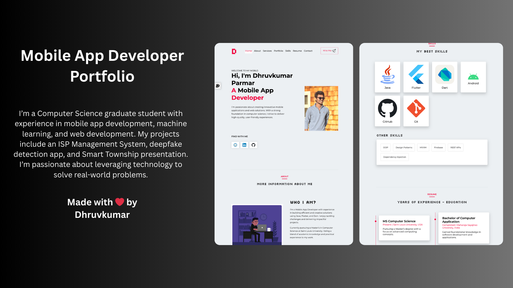

# Mobile App Developer Portfolio

**This portfolio website is designed for an Android developer, featuring a fully responsive design across all devices. The site includes customizable settings, such as an option to adjust the font size to suit individual user preferences. It’s enhanced with various animations to create a dynamic user experience. Built using HTML, CSS, and JavaScript, with Bootstrap for responsive design and FormSpree for efficient form handling.**

## Preview Details

 

### Technologies used

- HTML
- CSS
- Javascript
- Bootstrap grid
- Media Query

### Preview (https://dhruvprmr.github.io/Portfolio/)
